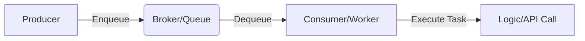

# Task Queues and Background Jobs: Foundation for Scalable and Responsive Backends

## Introduction

As a backend developer, understanding background jobs is critical for building applications that are both scalable and responsive. But what exactly is a background task, and why should you care?

A **background task** is any piece of logic or workflow that runs outside of the standard **request-response lifecycle**. In a typical synchronous interaction, a client makes a request, the server processes it, and the client waits for a response. A background job breaks this cycle by offloading operations that don't need to happen immediately to a separate process. This allows your server to respond to the client much faster, improving the overall user experience.

## Why Background Tasks?

To understand the necessity of background tasks, let's look at a common scenario: **User Signup**.

When a user signs up for your platform, they provide their email, name, and password. Your backend performs validations, hashes the password, and saves the user to the database. After this, you typically need to send a **verification email**.

### The Synchronous Problem

If you send this email synchronously within the signup request:
1.  Your server must call a third-party email provider (like Resend, Mailgun, or Bravo).
2.  Your server waits for the email provider's server to process the request and respond.
3.  If the email provider is slow or experiencing a spike in traffic, your user's signup request hangs.
4.  If the email provider is down, your signup API might fail entirely, or the user might be told an email was sent when it wasn't.

This leads to a poor user experience and a fragile system architecture.

### The Background Job Solution

Instead of waiting for the email to send, your server:
1.  Completes the essential database work.
2.  Creates a "task" containing the email details.
3.  Pushes this task into a **Queue**.
4.  Immediately returns a `201 Created` response to the user.

The user sees a "Check your email" screen in milliseconds, while a separate **worker process** picks up the task and handles the actual email delivery in the background.

## Core Concepts: Producers, Brokers, and Consumers

The architecture of a task management system relies on three main components:

### 1. The Producer
The producer is your main application code. Its responsibility is to create the task and **Enqueue** it. This involves taking all the information needed (User ID, email template, etc.) and serializing it—usually into a **JSON** format.

### 2. The Broker (Task Queue)
The broker is the engine that stores tasks until they are ready to be processed. It acts as a temporary holding area. Common technologies used as brokers include:
*   **Redis**: Extremely fast, often used with Pub/Sub modules.
*   **RabbitMQ**: A robust, dedicated message broker.
*   **Amazon SQS**: A managed, highly scalable queuing service.

### 3. The Consumer (Worker)
The consumer is a separate process (or thread) that constantly monitors the queue. When it finds a new task, it **Dequeues** it, deserializes the data back into its native format (a Python dictionary, JavaScript object, etc.), and executes the pre-registered handler function.

## Reliability and Error Handling

One of the greatest advantages of background jobs is the built-in reliability features.

### Acknowledgments
When a worker finishes a task, it sends an **Acknowledgment (ACK)** back to the broker. This tells the broker the task was successful and can be removed. If the worker crashes or the task fails, no acknowledgment is sent, allowing the broker to handle the failure.

### Visibility Timeout
This is the period during which a task is considered "in progress." If a worker doesn't acknowledge the task within this timeout, the broker assumes the worker failed and makes the task available to other workers. This ensures that tasks are never "lost" in the system.

### Retries and Exponential Backoff
When a task fails (e.g., due to an external API being down), background job libraries (like **Celery** for Python, **BullMQ** for Node.js, or **Asynq** for Go) can automatically retry the task.

A popular strategy is **Exponential Backoff**:
*   **1st failure**: Retry in 1 minute.
*   **2nd failure**: Retry in 2 minutes.
*   **3rd failure**: Retry in 4 minutes.
*   ...and so on, until a max retry limit is reached.

Since third-party downtime is often brief, these retries usually succeed on the second or third attempt without the user ever knowing there was a delay.

## Types of Background Tasks

### 1. One-off Tasks
Triggered by a specific event.
*   **Examples**: Sending a welcome email, triggering a push notification, or generating a one-time password (OTP).

### 2. Recurring Tasks (Cron Jobs)
Executed periodically at specific intervals.
*   **Examples**: Sending weekly stats reports, performing database cleanup (deleting "orphan" sessions), or generating monthly invoices.

### 3. Chained Tasks
Tasks that have a parent-child relationship or dependencies.
*   **Example: Video Processing Pipeline**:
    1.  **Task 1**: Encode video into multiple resolutions (Parent).
    2.  **Task 2**: Once encoded, generate thumbnails (Child).
    3.  **Task 3**: Parallelly, generate audio transcriptions (Child).

### 4. Batch Tasks
Triggering a large volume of similar tasks at once.
*   **Example: Massive Account Deletion**: When a user deletes their account, the backend might need to delete thousands of associated entities, assets, and logs across different regions. Instead of doing this in one request, it triggers a batch of background jobs to clean up the data incrementally.

## Design Considerations for Scale

### Idempotency
This is the most critical design rule: **Your tasks must be safe to execute multiple times.**
If a task fails halfway through and is retried, it should not cause duplicate side effects (e.g., charging a customer twice or sending two identical emails). Using database transactions and unique identifiers helps ensure idempotency.

### Monitoring
You need visibility into your queue health. Tools like **Prometheus** and **Grafana** are often used to track:
*   **Queue Length**: Is the backlog growing too fast?
*   **Failure Rates**: Why are tasks failing?
*   **Worker Health**: Are workers crashing or running out of memory?

### Horizontal Scalability
A well-designed system allows you to scale your workers horizontally. If you have a massive spike in traffic, you should be able to spin up more worker nodes to process the queue faster without changing your application logic.

### Rate Limiting
If your tasks interact with external services (like Google Maps or Stripe), you must implement rate limiting on your workers to avoid overloading those services and getting blocked or incurring unexpected costs.

## Best Practices

*   **Keep Tasks Small and Focused**: A single task should do one thing. If you need to do multiple things, use task chaining.
*   **Avoid Long-Running Tasks**: Break massive operations into smaller chunks.
*   **Robust Logging**: Log everything. Since background jobs run in separate processes, logs are your only way to debug what went wrong.
*   **Use Proper Error Handling**: Catch exceptions and let the queue's retry mechanism do its work.

## Conclusion

Background tasks are essential for building professional, scalable, and responsive backend applications. They prevent timeouts, handle external service failures gracefully, and significantly improve the user experience by keeping the main API fast and reliable. Whether you're sending a simple email or processing complex video data, mastering task queues is a hallmark of a senior backend engineer.
