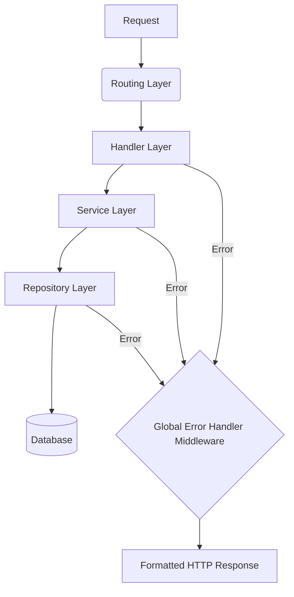

# Error Handling and Building Fault-Tolerant Systems

## Introduction

In the world of backend development, errors are not just problems to solve—they are a **normal part** of building applications. Every developer needs to understand that errors *will* happen. The key is to be ready for them: ready to detect them, ready to fix them, and ready to respond gracefully.

Here is the reality:
- Your database queries will sometimes fail.
- Your external APIs will sometimes time out.
- Your users will sometimes send bad data that can break your APIs.
- Your business logic will hit unexpected edge cases.

The question is not *whether* errors will happen, but **how you will handle them when they do**.

> [!IMPORTANT]
> This article is not about specific tools or frameworks. It's about building a **fault-tolerant mindset**—understanding the different types of errors, how to detect them, and the strategies to prevent them from cascading into major failures.

---

## The Different Types of Errors

Understanding the nature of errors is the first step towards handling them effectively. Let's categorize the most common types you'll encounter as a backend engineer.

### 1. Logic Errors

Logic errors are the sneaky ones. They are the most dangerous type because they **don't crash your application**—they just make it do the wrong thing. Your code runs fine, but the results are incorrect.

**Example**: Imagine an e-commerce store that accidentally applies a discount twice, giving customers negative shipping costs. The app doesn't crash, but the platform loses money on every single order.

These errors can go unnoticed for weeks or even months while quietly causing significant problems.

#### Why Do They Happen?
- **Misunderstanding requirements**: A point discussed with your product manager was confusing, leading to incorrect implementation.
- **Incorrect algorithm implementation**: A complex discount workflow has a slight miscalculation.
- **Unhandled edge cases**: A user behavior you didn't anticipate in the payment workflow.

> [!CAUTION]
> Logic errors can corrupt data and produce wrong business results over time without getting detected. Robust testing and monitoring are your best defenses.

---

### 2. Database Errors

Database errors can bring your entire system down since most backend apps rely heavily on their database. These errors range from simple connection problems to complex issues like deadlocks.

| Error Type | Description |
| :--- | :--- |
| **Connection Errors** | When your app cannot talk to your database. This could be due to the network being down, the database server being overloaded, or running out of connection pool resources. |
| **Constraint Violations** | When an operation breaks a database rule, like trying to create a user with an email that already exists (**Unique Constraint**) or referencing a foreign key that doesn't exist. |
| **Query Errors** | When your SQL is malformed (e.g., a typo in a table name) or when queries are too complex and time out. |
| **Deadlocks** | When multiple database operations are waiting for each other, creating a circular dependency. |

**Connection Pooling**: Backends use connection pools to keep a set of open TCP connections to the database, avoiding the overhead of a new handshake for every request. If you run out of connections in your pool, your application cannot function.

---

### 3. External Service Errors

Modern SaaS applications depend on a lot of external services: payment processors, email providers, cloud storage (S3), and authentication services (Auth0, Clerk). Each one of these dependencies is a **point of failure** that you don't have direct control over.

#### Reasons for External Service Failures:
1.  **Network Issues**: Connection timeouts, DNS failures, and network partitions.
2.  **Authentication Errors**: Bad credentials, expired tokens, or insufficient permissions when calling external APIs.
3.  **Rate Limiting**: External services have usage limits to prevent abuse. If your platform sends an abnormal amount of requests (perhaps due to a logic error), you'll receive a `429 Too Many Requests` response.
4.  **Service Outages**: Sometimes, major cloud providers go down. It's inevitable.

> [!TIP]
> **Exponential Backoff** is a common strategy for handling rate-limit errors. When you receive a `429`, wait for 1 minute and retry. If it fails again, wait for 2 minutes. Then 4 minutes. Keep doubling until you receive a successful response.

---

### 4. Input Validation Errors

These are the **easiest errors to handle** because they are predictable. Input validation errors occur when users send data that doesn't meet your system's requirements. Your validation layer is your **first line of defense** against bad data or malicious inputs.

| Validation Type | Example |
| :--- | :--- |
| **Format Validation** | Is the email in a valid format? Does the phone number look like a phone number? |
| **Range Validation** | Is the price too high or too low? Is the string too long? Does the array have at least 3 items? |
| **Required Field Validation** | Is a mandatory field (like `user_id`) present in the payload? |

For these errors, you typically return an HTTP `400 Bad Request`.

---

### 5. Configuration Errors

Configuration errors can prevent your app from starting or make your production environment behave unexpectedly. They usually appear when moving between development, staging, and production environments.

**Scenario**: You add a new `OPENAI_API_KEY` environment variable during development, merge the PR, but forget to add it to your production environment (e.g., AWS Parameter Store). What happens next?

- **Best Case (Preferred Setup)**: Your app validates all required environment variables at startup. If any are missing, **it fails immediately**. This is the goal. Your old deployment continues to run, and you can quickly identify and fix the missing configuration.
- **Worst Case**: Without startup validation, the app starts successfully. The error only occurs when a user makes a request that requires the missing key, resulting in a `500 Internal Server Error`.

> [!IMPORTANT]
> Always validate your configuration variables **before your server starts**. It is always better to crash during startup than to fail during runtime on a user's request.

---

## Error Prevention: Finding Errors Before They Spread

The best error handling starts **before** errors happen. This is the key strategy for building fault-tolerant systems.

### Health Checks

Health checks continuously monitor your system. You typically expose an endpoint like `/health` or `/status` that returns a simple `200 OK` response. External tools can ping this endpoint to verify the service is active.

But a simple health check is not enough. You must verify that your system is **actually doing its job**.

| Check Type | Purpose |
| :--- | :--- |
| **Database Health Checks** | Test database connectivity and query performance. If a query that usually takes 500ms now takes 5 seconds, something is wrong. |
| **External Service Health Checks** | Implement test calls to external services. For payment processors, run test transactions. For email services, send test messages to internal addresses. For auth services, generate and validate test tokens. |
| **Core Functionality Checks** | Ensure all required configuration variables are loaded, default caches are populated, and internal data structures are consistent. |

---

### Monitoring and Observability

Monitoring is a huge topic on its own, but the core idea is to **detect errors quickly** and provide enough context for debugging.

- **Don't just track error rates.** Also monitor **performance metrics**. A degradation in performance (slower response times, higher resource usage) is often an early warning sign of an impending failure.
- **Track all error sources**: HTTP errors, database errors, external service failures, and business logic errors.
- **Monitor business metrics**: A sudden drop in successful transactions might indicate a technical problem even if error rates appear normal.
- **Use structured logging**: Implement JSON logs that can be easily parsed by tools like Grafana and Loki for visual dashboards and searchability.

---

## Error Response Strategies

When an error does happen, your immediate response determines whether it becomes a minor issue or a major failure.

### Recoverable Errors

For errors that can be retried (network failures, temporary resource limits), use **retry mechanisms** and **exponential backoff**.

**Example**: An email-sending service fails. This is not time-sensitive; you can afford a delay. Retry after 1 minute, then 2 minutes, then 4 minutes, until it succeeds.

> [!WARNING]
> Be careful not to overwhelm an already stressed system. Your error handling logic should not add more load.

### Non-Recoverable Errors

For errors that cannot be retried, the strategy is **containment and graceful degradation**.

- Switch to cached data.
- Disable non-essential features.
- Provide alternative or fallback functionality.
- Contain the scope of the damage to prevent it from affecting other services.

---

## Error Recovery Strategies

### Automatic Recovery

Many errors can be handled without human intervention:
- **Restarting a failed service**: Orchestrators like Kubernetes can automatically restart a crashed process.
- **Cleanup Functionality**: Cleaning up corrupted caches or switching to backup systems.

### Manual Recovery

Some errors require human judgment. For these:
- **Document the recovery process**: Ensure all team members and new hires know how to handle specific incidents.
- **Test your procedures**: You need to know they work *before* a stressful production incident.
- **Execute quickly**: Fast decision-making is key to minimizing user impact.

### Data Recovery

Data is the most important part of your application. Data integrity should be a top priority.
- Take **backups** at key moments.
- Restore from backups when necessary.
- Replay transaction logs using specialized recovery tools.

---

## Propagation Control: Bubbling Up Errors

Not all errors should be handled exactly where they occur. Sometimes, errors need to propagate to higher levels where there is more context.

### Exception Handling Hierarchies

In languages like Python or JavaScript, you use `try-catch` blocks. The pattern is:
1.  Catch lower-level exceptions.
2.  Wrap them with enough context (a stack trace, a user ID, etc.).
3.  Re-throw or propagate them to a higher-level global handler.

This allows you to have more business context, log appropriate data, and send meaningful error messages to the frontend.

### Error Boundaries

In a service-oriented architecture, error boundaries prevent errors in one service from affecting others.
- Use **separate processes** for different services.
- Implement **timeouts** to protect service-level boundaries.
- Use **message queues** (like RabbitMQ) for asynchronous, decoupled communication between services. A bug in one service should not cause a cascading failure.

---

## The Final Safety Net: Global Error Handling

This is one of the most important error-handling strategies you can implement in a backend app. A global error handling middleware acts as the **final safety net**, catching every error that bubbles up from your application layers.

### How It Works

Consider a common backend architecture:

Regardless of which layer throws an error, it propagates up to the **Global Error Handler Middleware**. This middleware inspects the error type and returns an appropriate, standardized response.

### Example: Book Management API

Let's trace different error scenarios for a "Create Book" endpoint.

| Scenario | Layer | Error Type | Global Handler Response |
| :--- | :--- | :--- | :--- |
| Book name exceeds 500 characters. | Handler (Validation) | `ValidationError` | `400 Bad Request` with field-specific error messages. |
| A book with this name already exists. | Repository (Database) | `UniqueConstraintViolation` | `400 Bad Request` with message: "A book with this name already exists." |
| A `GET /books/123` request for a book that doesn't exist. | Repository (Database) | `NoRowsFound` | `404 Not Found` with message: "Book with ID 123 does not exist." |
| A create request with an `author_id` that doesn't exist. | Repository (Database) | `ForeignKeyViolation` | `404 Not Found` with message: "Author with this ID does not exist." |

### Advantages of a Global Error Handler

1.  **Robustness**: There is no risk of forgetting to handle a specific error condition in a specific function. All paths lead to the global handler.
2.  **Reduced Redundancy**: You don't have to repeat error-handling logic (e.g., checking for unique constraint violations) in every repository method. It's centralized.
3.  **Consistent API Responses**: Frontend developers can always expect a predictable error structure.

---

## Security Considerations in Error Handling

Error handling and security are deeply intertwined. Poor error handling can create significant vulnerabilities.

### 1. Don't Leak Internal Details

Your default error handling mechanism must **never** leak internal details.

- **Bad**: Returning a raw database error message that includes table names, column names, constraint names, or index details.
- **Good**: Returning a generic `500 Internal Server Error` with the message "Something went wrong."

Malicious users can use exposed database schema information to craft more advanced attacks, like SQL injection.

> [!CAUTION]
> For your default `500` error, always use a generic message like "Something went wrong" or "Internal Server Error." Never forward raw exception messages to the client.

### 2. Avoid Information Leakage in Authentication

Authentication modules are prime targets for attackers.

**Scenario**: A login endpoint. The user provides an email and password.

| Naive Error Message | Security Risk |
| :--- | :--- |
| "A user with this email does not exist." | An attacker can enumerate valid email addresses by trying different inputs. Once they get "Incorrect password," they know the email is valid. |
| "Incorrect password." | This confirms the email is valid. |

**Secure Approach**: Always return the same error message: **"Invalid email or password."** This gives attackers no information about whether the email exists or if the password was incorrect.

### 3. Protect Sensitive Information in Logs

Logs are a common source of data breaches. Major companies use multiple external services for log aggregation, storage, and analysis. If these logs get leaked, any sensitive data within them is exposed.

- **Never log**: User passwords, API keys, credit card numbers, or other PII.
- **Always log**: User IDs (not emails), Correlation IDs, and request identifiers for debugging without exposing personal data.

---

## Summary

Building fault-tolerant systems is a mindset. It requires accepting that errors are inevitable and planning for them proactively. By understanding the different types of errors, implementing robust health checks, building a centralized global error handler, and following security best practices, you create a backend that is resilient, secure, and provides a reliable experience for your users.

The best time to think about error handling is before your application ever encounters an error—and the second-best time is right now.
