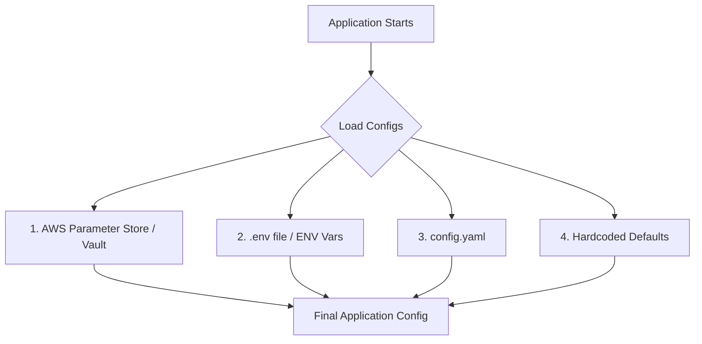

# Configuration Management: The DNA of Your Backend

## Introduction

In backend engineering, we often focus intensely on algorithms, database schemas, and API design. However, there's a vital component that often gets overlooked until it causes a production incident: **Configuration Management**.

If you think of your backend application as a living organism, configuration management is its **DNA**. It decided how your code behaves, how it connects to the world, and what features it enables across different environments (Development, Staging, Production).

> [!NOTE]
> Configuration management is the systematic approach to organizing, storing, and accessing all the settings of your application.

---

## Beyond Secrets: The True Scope

When most developers hear "configuration," they immediately think of sensitive data:
- Database passwords
- JWT secret keys
- Stripe/Payment API keys
- External service credentials

While these are critical, they represent only a fraction of what configuration management actually handles. Thinking a car is just an engine misses 90% of the vehicle. Similarly, configuration management controls:
- **Startup Behavior**: How the application initializes.
- **Connectivity**: How it talks to external services.
- **Observability**: What it logs, where it sends traces, and how it reports metrics.
- **Feature Management**: Which features are enabled or disabled for specific versions or users.

---

## Different Types of Configuration

Not all configurations are created equal. Understanding their types helps in choosing the right storage and security measures.

### 1. Application Settings
These are generic settings required for the application to function.
- **Log Level**: `DEBUG` in dev, `INFO` or `WARN` in prod.
- **Server Port**: e.g., `8080`.
- **Connection Pool Size**: Optimizing database connections.
- **Timeout Values**: How long to wait for a database query or an external API call.

### 2. Database Configuration
Essential details for connecting to your data store.
- **Host & Port**: Where the database lives.
- **Credentials**: Username and Password.
- **Database Name**: The specific schema to use.

### 3. External Services
Modern backends are part of a distributed system. You likely connect to:
- **Email Providers** (Mailchimp, Resend)
- **Payment Processors** (Stripe)
- **Auth Providers** (Clerk, Auth0)

### 4. Feature Flags
Feature flags allow you to dynamically enable or disable features without redeploying code.
- **A/B Testing**: Showing different checkout flows to different users.
- **Canary Releases**: Enabling a new feature for only 5% of your users.

### 5. Other Types
- **Infrastructure Config**: DevOps-related settings.
- **Security Config**: Session timeouts, encryption keys.
- **Business Rules**: Max order amounts, discount limits.

---

## Storage and Sources: Where Do Configs Live?

Where you store your configuration depends on your environment and security needs.

| Source | Description | Best For |
| :--- | :--- | :--- |
| **Environment Variables** | Variables loaded into the OS environment. | Most backend apps (Node.js, Go, Python). |
| **Configuration Files** | YAML, JSON, or TOML files. | Complex, hierarchical settings (often Open Source). |
| **Key-Value Stores** | Redis, Consul, etcd. | Distributed systems needing dynamic updates. |
| **Cloud Secret Managers** | AWS Parameter Store, GCP Secret Manager, Vault. | Sensitive production secrets and enterprise-scale apps. |

### Configuration Priority & Hybrid Strategies
Most modern applications use a **Hybrid Strategy**. They load configs from multiple sources with a specific priority.

---

## Environmental Isolation

Each environment has different priorities, and your configuration must reflect that.

| Environment | Primary Priority | Example Config |
| :--- | :--- | :--- |
| **Development** | Productivity & Debugging | `LOG_LEVEL=DEBUG`, `DB_POOL_SIZE=10` |
| **Testing** | Automated Validation | Mock API Keys, ephemeral database URLs. |
| **Staging** | Production Mirroring | `DB_POOL_SIZE=2` (Save costs while mirroring prod). |
| **Production** | Reliability & Security | `LOG_LEVEL=INFO`, `DB_POOL_SIZE=50`, High-security keys. |

---

## Security Best Practices

> [!CAUTION]
> A misconfigured backend can expose customer data, process payments incorrectly, or bring down the entire platform.

1.  **Never Hardcode Secrets**: Hardcoded secrets in your codebase are a ticking time bomb.
2.  **Use Cloud Secret Managers**: Services like HashiCorp Vault encrypt secrets both "at rest" and "in transit."
3.  **Principle of Least Privilege**: Ensure only the necessary services/people have access to specific configurations. (e.g., Frontend devs don't need access to production DB URLs).
4.  **Rotate Secrets Periodically**: Regularly changing API keys and passwords reduces the risk of long-term exposure.

---

## The Golden Rule: Always Validate Your Config

If you take only one thing from this article, let it be this: **Validate your configurations at startup.**

Most developers simply access environment variables using `process.env.DB_URL`. However, if that variable is missing or malformed, your application might crash much later in a way that's hard to debug.

**The Solution**: Use validation libraries (like **Zod** for TypeScript or **Go Validator** for Go) to check your configs during the loading phase.

- **Fail Fast**: If a mandatory config is missing, the application should fail to start immediately.
- **Consistency**: Ensures the types are correct (e.g., Port should be a number, not a string).

> [!IMPORTANT]
> It is always better to crash during startup with a clear "Missing DB_URL" error than to fail in the middle of a user's transaction.

---

## Summary

Configuration Management isn't just a DevOps task; it's a fundamental part of backend engineering. By centralizing your settings, isolating environments, and validating your configurations, you build a system that is resilient, flexible, and secure.

Remember: **Don't let your configuration become a chaos—make it your system's DNA.**
