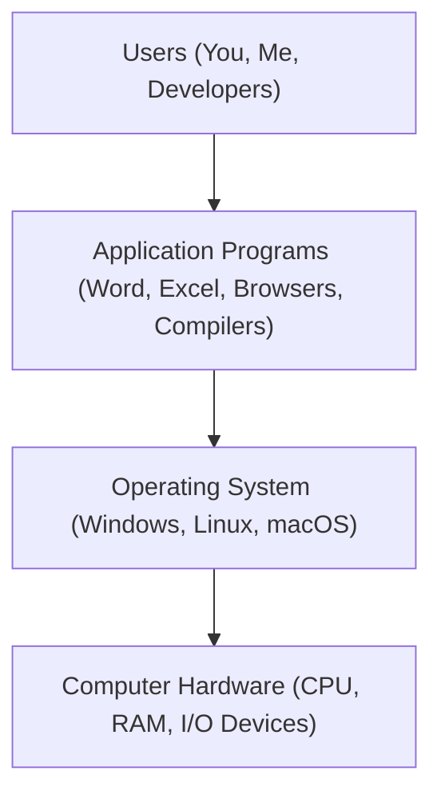

# Introduction to Operating Systems: The Core of Computing

Welcome to the first post in our Operating Systems series! Whether you're a computer science student, an electronics enthusiast, or just curious about how your devices work, understanding the Operating System (OS) is fundamental. It is the bridge between you and the complex circuitry of your computer.

In this post, we’ll explore what an operating system is, why we need it, its primary functions, and its ultimate goals.

---

## What is an Operating System?

At its simplest, an **Operating System (OS)** is a program that manages computer hardware. It acts as an intermediary between the computer user and the computer hardware.

Key definitions:
- It provides a **basis for application programs** (like Word, Chrome, or Games) to run.
- It **manages hardware resources** like the CPU, memory, and storage.
- It acts as an **intermediary**, making the hardware accessible to users without requiring them to understand complex machine code.

### Popular Examples of Operating Systems
- **Windows**: The most widely used OS for desktops and laptops.
- **Linux & Ubuntu**: Open-source operating systems favored by developers and for servers.
- **macOS**: Apple’s proprietary OS for MacBooks and iMacs.
- **iOS**: The operating system for iPhones.
- **Android**: The world's most popular mobile OS.

---

## The Basic Structure of a Computer System

To understand the OS's role, we need to look at how a computer is layered. Imagine a hierarchy where each layer builds upon the one below it.

### The Four Main Components:
1.  **Computer Hardware**: The physical resources like the Central Processing Unit (CPU), Memory (RAM and ROM), and Input/Output (I/O) devices (Keyboard, Mouse, Monitor, Speakers).
2.  **Operating System**: The software that controls and coordinates the use of hardware among various applications.
3.  **Application Programs**: Software used to perform specific tasks (e.g., Word Processors, Spreadsheets, Web Browsers).
4.  **Users**: People or other computers attempting to solve problems using the system.

---

## Why Do We Need an OS? (The Intermediary Role)

Imagine trying to use a computer without an OS. If you wanted to write a simple document in Microsoft Word and save it, you would have to:
1.  Write code to tell the hardware to load Word into RAM.
2.  Write code to capture every keystroke from the keyboard.
3.  Write code to manually draw every character on the monitor.
4.  Write code to find a specific physical location on your hard drive to save the file.

This would be incredibly tedious and nearly impossible for the average person. 

**The OS takes care of all these "low-level" tasks.** When you double-click an icon, the OS handles the loading, the display, and the saving. It hides the complexity of the hardware, providing a seamless experience.

---

## Functions of an Operating System

An OS performs several critical functions to keep the system running smoothly:

1.  **User Interface**: It provides a way for users to interact with the hardware (GUI, CLI, etc.).
2.  **Resource Allocation**: Since hardware resources (like CPU time and RAM) are limited, the OS decides how to distribute them among different users and programs fairly and efficiently.
3.  **Memory Management**: It tracks which parts of the memory are currently being used and by whom, and handles loading/saving data between primary and secondary memory.
4.  **Security**: It protects the data and resources of one user from being accessed or modified by another unauthorized user.

---

## Goals of an Operating System

When engineers design an OS, they generally aim for two primary goals:

-   **Convenience**: Making the computer easy to use. Most consumer OSs (like Windows or macOS) prioritize this.
-   **Efficiency**: Using the hardware as effectively as possible. Server-based OSs often prioritize efficiency to handle thousands of tasks simultaneously.

Most modern operating systems strive for a balance between both convenience and efficiency.

---

## Types of Operating Systems

As we progress through this course, we will dive deeper into different types of OS architectures, including:
-   **Batch OS**
-   **Time-Sharing OS**
-   **Distributed OS**
-   **Network OS**
-   **Real-Time OS**
-   **Multi-programming, Multiprocessing, and Multitasking systems**

---

## Conclusion

The Operating System is the "soul" of the computer hardware. Without it, our powerful machines would be nothing more than expensive boxes of electronics. In the next post, we will explore the different types of operating systems in detail and how they have evolved over time.
